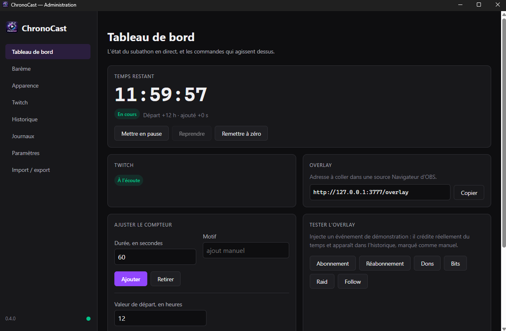
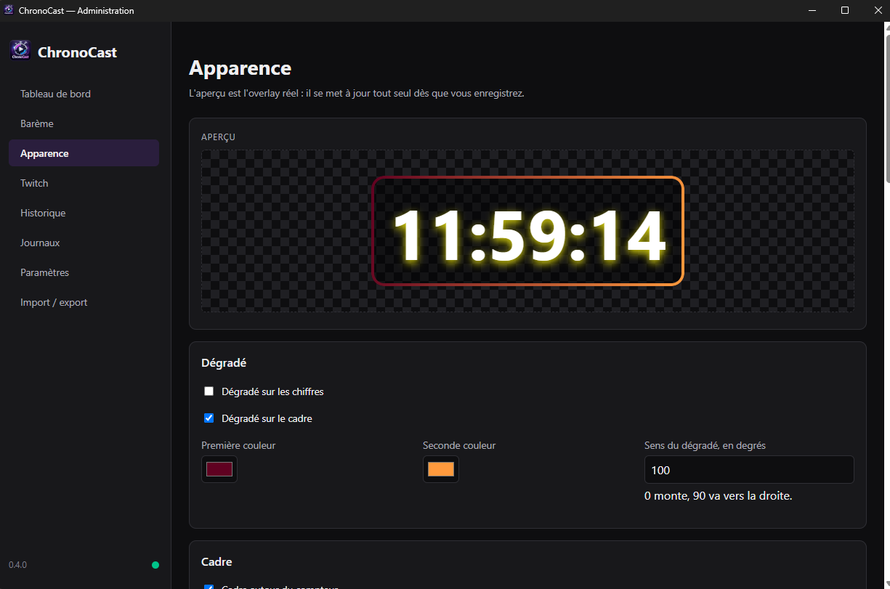
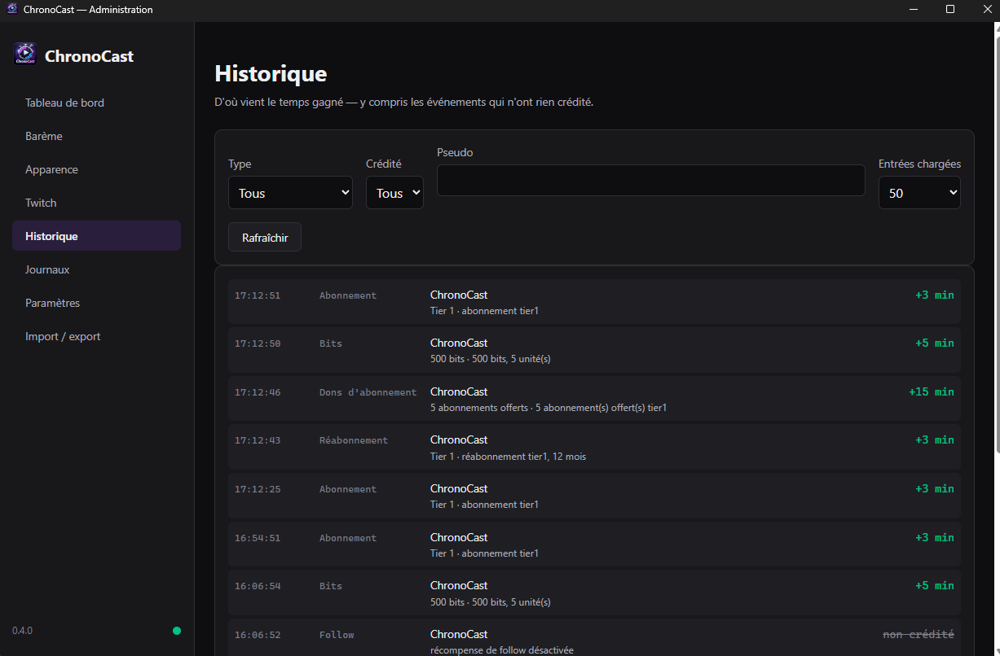

# ChronoCast

Compteur subathon Twitch pour OBS : un compte à rebours affiché sur le stream, qui
s'incrémente automatiquement à chaque sub, resub, gift sub, sub Prime ou don de bits.

Tout fonctionne en local. Aucun serveur, aucune base de données distante, aucun
abonnement : la seule communication sortante est celle qui va vers Twitch.

## En deux mots

- **Un overlay** à ajouter dans OBS comme simple Browser Source, fond transparent.
- **Un panneau d'administration** local pour tout piloter : barème, apparence,
  pause, ajout ou retrait de temps, historique, logs.
- **Une connexion Twitch EventSub** en WebSocket, sans nom de domaine ni port
  ouvert sur Internet.
- **Un état persistant** : le compteur survit à une fermeture, à un crash et à un
  redémarrage du PC, et repart exactement là où il s'était arrêté.

## Aperçu

Le tableau de bord : l'état du subathon, les commandes qui agissent dessus, et
l'adresse à coller dans OBS.



L'apparence se règle entièrement depuis le panneau, et l'aperçu affiché **est
l'overlay réel** — ce que vous y voyez est ce qu'OBS affichera.



L'historique dit d'où vient le temps gagné, y compris les événements qui n'ont
rien crédité.



## Installation

ChronoCast s'installe depuis le **Microsoft Store** :

**[Installer ChronoCast](https://apps.microsoft.com/detail/9MT0NZV7KXGV)**

Aucune dépendance à installer : Node.js, le serveur HTTP et le serveur WebSocket
sont embarqués dans l'application. Lancez-la, puis suivez l'assistant de
première configuration.

Le Store est le **seul** canal de distribution, et aucun `.exe` n'est plus
publié sur GitHub. C'est un choix, pour une raison simple : un binaire non signé
faisait afficher un avertissement SmartScreen au premier lancement, se faisait
mettre en quarantaine par certains antivirus, et n'était trouvable que par qui
savait déjà où chercher. Le paquet du Store est **signé par Microsoft**, ce qui
règle les trois d'un coup.

Les mises à jour sont **automatiques**, gérées par le Store, et s'appliquent
quand l'application n'est pas en cours d'exécution : aucune fermeture surprise
en plein direct.

Plateforme prise en charge : **Windows**. Linux et macOS sont envisagés pour une
version ultérieure.

> **Vous veniez d'une version installée depuis GitHub ?** Vos données —
> compteur en cours, configuration, jetons Twitch — sont **reprises
> automatiquement** au premier lancement de la version du Store. L'ancienne
> installation reste intacte ; vous pouvez la désinstaller ensuite.

## Documentation

| Document | Contenu |
| --- | --- |
| [docs/USER-GUIDE.md](docs/USER-GUIDE.md) | Guide utilisateur : installation, connexion à Twitch, ajout dans OBS |
| [docs/OVERLAY-CUSTOMIZATION.md](docs/OVERLAY-CUSTOMIZATION.md) | Personnalisation de l'overlay |
| [docs/ARCHITECTURE.md](docs/ARCHITECTURE.md) | Architecture, flux de données, choix techniques |
| [docs/DEVELOPER.md](docs/DEVELOPER.md) | Guide développeur |
| [docs/BUILD.md](docs/BUILD.md) | Procédure de build |
| [docs/RELEASE.md](docs/RELEASE.md) | Procédure de publication |
| [docs/TESTING-TWITCH-CLI.md](docs/TESTING-TWITCH-CLI.md) | Tests avec la Twitch CLI |
| [docs/CRASH-RECOVERY.md](docs/CRASH-RECOVERY.md) | Récupération après crash |
| [docs/SECURITY.md](docs/SECURITY.md) | Modèle de menace et contrôles de sécurité |
| [docs/PRIVACY.md](docs/PRIVACY.md) | Politique de confidentialité |
| [docs/REPRISE-V2.md](docs/REPRISE-V2.md) | Document de reprise : état d'avancement et décisions en vigueur |
| [docs/REPRISE.md](docs/REPRISE.md) | Archive de la V1 : les huit phases et leurs décisions |

## Développement

Le projet se développe **entièrement en conteneur** : aucun binaire Node n'a
besoin d'être installé sur la machine.

```bash
./scripts/dc.sh install     # installe les dépendances
./scripts/dc.sh test        # suite de tests
./scripts/dc.sh verify      # lint + typecheck + tests + audit
./scripts/dc.sh build       # compilation TypeScript
./scripts/dc.sh help        # toutes les commandes
```

Le paquet MSIX, lui, n'est pas construit en local : il l'est par le workflow
`Release`, nativement sur un runner Windows — la cible AppX réclame le SDK
Windows. Voir [docs/BUILD.md](docs/BUILD.md).

Le développement suit un TDD strict : aucune ligne de code de production n'est
écrite sans un test qui a d'abord échoué. Voir [docs/DEVELOPER.md](docs/DEVELOPER.md).

## Licence

MIT
