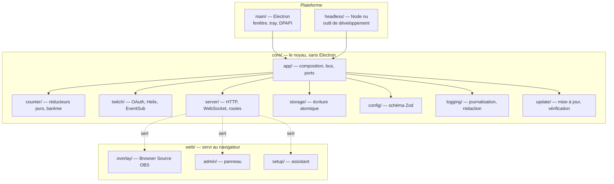
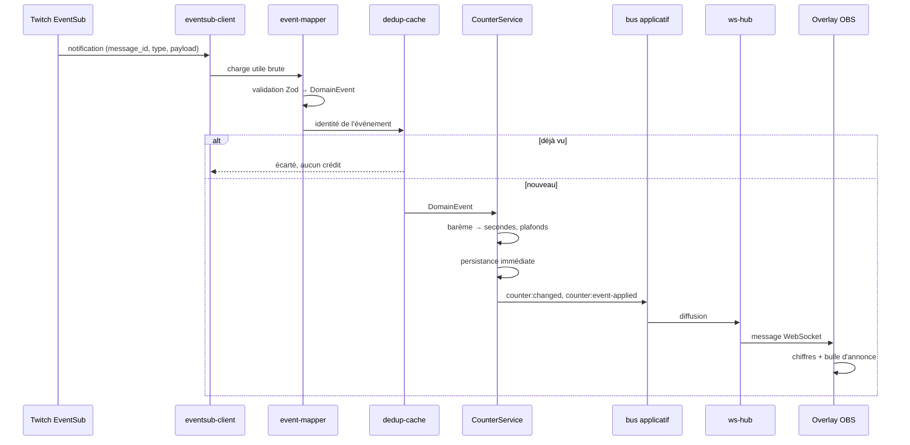

# Architecture

ChronoCast est une application Electron entièrement locale. Un noyau TypeScript porte tout le métier, une coquille Electron l'installe sur Windows, un serveur HTTP local sert trois pages web, et un client EventSub écoute Twitch.

Ce document décrit les couches, les flux et les décisions qui les expliquent. Pour travailler dans le code, lire ensuite [DEVELOPER.md](DEVELOPER.md).

---

## 1. Le principe directeur

**`src/core/**` n'importe jamais `electron`, et une règle ESLint le refuse.**

Tout ce qui touche à la plateforme passe par des ports injectés, déclarés dans `src/core/app/ports.ts` : `PathProvider` (où sont les données), `SecretStore` (comment on chiffre), `Clock`, `Ticker`, `BrowserOpener`, et `UpdateInstaller` (comment on lance un installeur et on s'arrête). Le noyau reçoit des implémentations, il n'en choisit aucune.

Ce n'est pas de la pureté d'architecture pour elle-même. C'est ce qui rend le produit **testable dans un conteneur Linux sans Chromium**, alors que sa cible est un `.exe` Windows. Sans cette séparation, l'immense majorité du code ne pourrait être éprouvée qu'à la main, sur un poste, après un build de plusieurs minutes.

La Phase 6 a poussé le principe jusqu'au bout : **trois fichiers seulement importent `electron`** — `main/main.ts`, `main/windows.ts`, `main/tray.ts` — et **aucun ne prend de décision**. Quelle navigation aboutit, ce que propose le menu du tray, quelle page recharger après une autorisation : tout cela vit dans des modules purs, testés. Ces trois fichiers sont nommément exclus de la couverture, ce qui rend la discipline mécanique plutôt que déclarative.

Le pari a été vérifié : quand l'application a enfin tourné sur un vrai poste Windows, **rien n'a dû être corrigé dans ces trois fichiers**.

## 2. Les couches

**`core/app/application.ts` est la racine de composition** : le seul endroit qui connaît tout le monde. Il fabrique les services, les câble entre eux, et rend un objet dont l'interface tient en quelques méthodes. Les deux points d'entrée — Electron et headless — ne diffèrent que par les ports qu'ils lui passent.

**`core/update/` illustre le principe jusqu'au bout.** Comparer deux versions, valider une charge utile de l'API GitHub, vérifier une empreinte, décider s'il faut télécharger : tout cela est pur et se vérifie en conteneur. Un seul geste ne s'y vérifie pas — lancer l'installeur téléchargé puis terminer l'application — et il passe donc par un port, `UpdateInstaller`, dont l'implémentation reçoit `spawn` et `quit` par injection. **Le port est facultatif** : sans lui, le service reste inerte, ce qui est le cas du point d'entrée headless, qui n'est ni packagé ni installé.

**`web/` est du code navigateur.** Il n'importe du noyau que des **types**, jamais de valeur : une règle ESLint le garantit, et `src/web/shared/protocol.ts` redéclare le contrat du WebSocket plutôt que de le ré-exporter — contrainte de `rootDir` en TypeScript, tenue par un test qui fait échouer la compilation dès qu'un champ diverge.

## 3. Le flux d'un événement Twitch

C'est le chemin critique du produit : d'un sub jusqu'aux pixels d'OBS.

**La déduplication est indispensable, pas défensive.** Twitch retransmet les notifications tant qu'il n'a pas eu son accusé, et surtout **plusieurs flux décrivent le même fait** : un sub Prime apparaît dans `channel.subscribe` *et* dans `channel.chat.notification`. Sans dédoublonnage, le compteur crédite deux fois — un bug qui ne se voit qu'en direct, avec des spectateurs qui comptent.

L'ordre du catalogue de souscriptions en découle : `channel.chat.notification` est déclaré **en premier** parce que c'est le seul flux qui distingue un Prime d'un Tier 1. En cas de doublon sémantique, c'est donc lui qui aura fixé le palier.

## 4. Le serveur local

Un seul serveur HTTP, sur `127.0.0.1:3777` par défaut, avec le WebSocket **attaché au même écouteur**. Il n'y a jamais eu de second port, et un réglage qui le promettait a été retiré du schéma parce qu'il ne produisait aucun effet.

| Chemin | Contenu |
| --- | --- |
| `/overlay` | La page pour OBS. Aucun jeton CSRF : elle ne mute rien |
| `/admin` | Le panneau. Jeton CSRF injecté à la volée |
| `/setup` | L'assistant de première configuration |
| `/custom.css` | La feuille personnelle, si elle est activée |
| `/api/*` | L'API du panneau |
| `/` | Redirige vers `/setup` ou `/admin` selon l'avancement |

**Un second serveur existe, éphémère** : celui du rappel OAuth, sur le port fixe **37771**. Il n'est armé que le temps d'une autorisation et s'éteint dès le rappel reçu. Son port est fixe parce que Twitch exige une correspondance exacte avec l'URL déclarée, alors que le port applicatif est configurable et peut se replier s'il est déjà pris — les deux ne pouvaient pas être le même.

Ce serveur écoute **sur les deux adresses de bouclage**, `127.0.0.1` et `::1`. Twitch n'accepte une redirection en HTTP que vers le **nom** `localhost`, et un nom se résout : sous Windows il mène souvent à `::1` d'abord. N'écouter que l'IPv4 ferait échouer le rappel **après** que l'utilisateur a donné son accord — le pire moment pour échouer.

## 5. Le bus applicatif

Producteurs et consommateurs ne se connaissent pas. Le catalogue est un type unique, `core/app/app-events.ts`, et le typage impose la bonne charge utile de part et d'autre.

| Événement | Émis quand |
| --- | --- |
| `counter:changed` | Le compteur change de valeur ou d'état |
| `counter:finished` | Le plancher est atteint. Une seule fois |
| `counter:event-applied` | Un événement Twitch a été évalué par le barème |
| `counter:persist-failed` | L'état n'a pas pu être écrit. Le compteur continue |
| `twitch:status` | La connexion EventSub change d'état |
| `twitch:revocation` | Twitch a retiré une souscription |
| `twitch:subscription-failed` | Une souscription n'a pas pu être créée |
| `oauth:settled` | Un flux d'autorisation s'achève, quelle qu'en soit l'issue |

`oauth:settled` mérite un mot : c'est par lui que la fenêtre Electron revient au premier plan à la fin d'une autorisation, le flux s'étant entièrement déroulé dans le navigateur système. Il est **distinct de `twitch:status`** à dessein — celui-ci change à chaque reconnexion, y compris en plein direct, et y accrocher le retour au premier plan ferait passer la fenêtre par-dessus OBS.

## 6. La persistance

| Fichier | Écriture |
| --- | --- |
| `config.json` | À chaque modification, atomique |
| `counter.json` | Mutations immédiates, érosion toutes les 5 s |
| `secrets.json` | Chiffré par DPAPI, jamais en clair |
| `history/*.jsonl` | Une ligne par événement |
| `logs/*.log` | Journalisation |

**L'écriture atomique** — temporaire, `fsync`, `.bak`, `rename` — et le repli en cascade à la lecture sont détaillés dans [CRASH-RECOVERY.md](CRASH-RECOVERY.md).

**L'historique est en JSON Lines** et non en JSON : une ligne corrompue n'emporte pas les autres, et l'ajout ne demande pas de relire le fichier entier.

## 7. Le magasin de secrets

Deux implémentations, deux comportements assumés et opposés.

**Electron** (`main/safe-storage-secret-store.ts`) s'appuie sur `safeStorage`, donc sur DPAPI, qui lie le chiffrement au compte Windows. Deux règles absolues : il **ne se replie jamais en clair** — si le chiffrement est indisponible, l'écriture échoue franchement plutôt que de donner l'illusion contraire — et **un blob indéchiffrable rend `null`, jamais une exception**. Ce cas arrive pour de vrai, quand un répertoire de données est recopié depuis un autre compte : l'utilisateur doit retomber sur l'assistant, pas sur un écran de crash.

**Headless** (`headless/aes-secret-store.ts`) chiffre en AES avec une clé locale. Il est honnêtement dégradé et le dit : c'est un outil de développement, pas un livrable.

## 8. Les choix qu'il ne faut pas rouvrir

**EventSub WebSocket, jamais de webhooks.** Un webhook exigerait un nom de domaine et un port ouvert sur Internet — impensable pour une application qui tourne sur le PC d'un streamer.

**Aucune valeur métier codée en dur.** Tout passe par le schéma Zod de `core/config/schema.ts`, ce qui rend tout réglable depuis le panneau. Le schéma est en mode `strip` : une clé inconnue est écartée silencieusement, ce qui permet à une configuration d'une autre version d'être acceptée plutôt que rejetée — et neutralise au passage la pollution de prototype.

**Le compteur est une machine à état pure.** Les réducteurs de `core/counter/` ne connaissent ni le temps réel, ni le disque, ni le réseau : ils prennent un état et une action, ils rendent un état. C'est ce qui permet de tester des scénarios de plusieurs heures en quelques millisecondes.

**Deux horloges.** `now()` pour les horodatages, `monotonicMs()` pour mesurer des durées. C'est la seconde qui fait décompter le compteur : avec la première, le passage à l'heure d'hiver offrirait une heure de subathon.

**Un seul port.** Voir plus haut : le WebSocket est attaché au serveur HTTP, sans alternative.

## 9. Sécurité

L'application affiche du contenu **choisi par des tiers non fiables** — pseudonymes, messages de cheer — dans une page. Les contrôles correspondants sont décrits dans [SECURITY.md](SECURITY.md), et tenus par une suite de tests dédiée.
